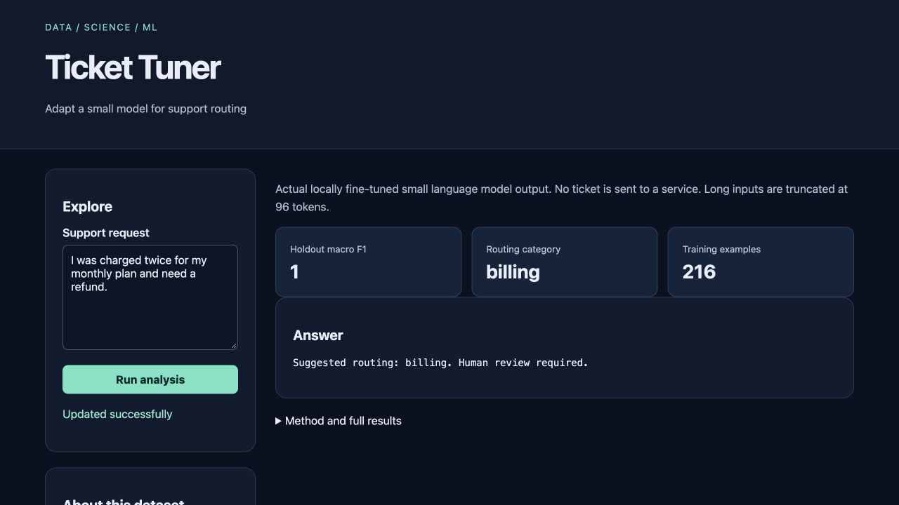

# Ticket Tuner

Adapt a small model for support routing for **support platform developers**.

Original topic: **Fine-Tuned LLM for a Niche Task** from [the source post](https://www.instagram.com/p/DdyMaogE4ud/).

> Local portfolio implementation developed with Codex assistance. Measured results and limitations are documented; no production adoption, revenue or hiring outcome is claimed.



## What works

- Fine-tuning
- grouped splits
- baseline
- saved model
- inference

[Example output](reports/example-output.json) · [Recorded checks](reports/test-results.txt) · [Learning and interview guide](LEARNING_GUIDE.md)

## Start

Python 3.12 is the validated Python runtime. Run commands from this repository directory. Windows users activate `.venv\Scripts\activate` instead of `source`.

```sh
python3.12 -m venv .venv
source .venv/bin/activate
python -m pip install -r requirements.txt
python generate.py
python train.py
python app.py
```

Open **http://127.0.0.1:8080**. Keep the process running. Set `PORT` to use another port. The Python development servers are intended for local demonstrations.

Training downloads the pinned Apache-2.0 FLAN-T5-small model and saves the selected checkpoint under ignored `artifacts/model/`. Retraining is required after a clean clone. The measured evaluation report is committed; model weights are not embedded in Git.

## Demonstration

Generate the corpus, run train.py, and inspect artifacts/evaluation.json. Start the app and classify a short ticket. Try an out-of-domain request and explain why a human review policy is still required.

## Architecture and decisions

Browser controls → validated Flask API → project analysis/workflow → results and export.

Stack: PyTorch · Transformers.

1. Fine-tune actual FLAN-T5-small weights locally for three support routing labels.
2. Split by template family before expanding examples so paraphrase groups cannot leak across splits.
3. Choose the checkpoint using validation macro F1, then evaluate the test set once against TF-IDF and majority baselines.

## Verification

```sh
python -m pytest -q
# Inspect artifacts/evaluation.json for real training and holdout evidence.
```

See [VERIFICATION.md](VERIFICATION.md) for actual executed checks, setup verification, model/data results and any outstanding environment limitations. The [recorded CI runs](reports/ci-verification.json) passed for the linked source revision.

## Data and attribution

Authored synthetic support corpus. See [DATA_AND_SOURCES.md](DATA_AND_SOURCES.md) for provenance and usage notes. Original project code is MIT unless a preserved source file or dependency states otherwise. Model and third-party data licenses remain separate.

## Limitations and next improvement

Authored synthetic data contain only three labels and a small number of templates. Perfect synthetic holdout scores are not evidence of production accuracy. Inputs truncate at 96 tokens. Model weights require several hundred MB and local CPU time; they are saved locally but excluded from Git.

Suggested extension: Add a fourth routing class with new, independently split template families and rerun all baselines.

## Honest portfolio use

This implementation and documentation were developed with substantial Codex assistance. Before presenting it, run the demonstration, explain the design choices, and complete the suggested independent modification. Do not describe generated code as work experience, an accepted upstream contribution, or a deployed production service.


[Publication provenance and current verification notes](PUBLICATION.md) · [Categorized collection](https://github.com/madhurag123/portfolio-index)
